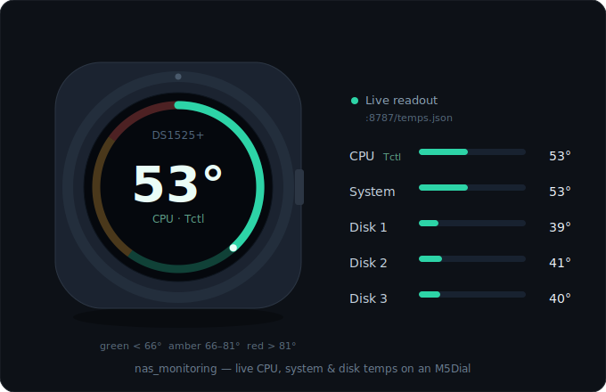

<div align="center">

# 🌡️ nas-monitoring

**English** · [中文](README.zh-CN.md)

**Turn an AMD‑based Synology NAS into a clean temperature JSON API —
CPU, system board, and every disk — ready for an ESP32 / M5Dial desk display.**


-ed1c24)


<br/>



</div>

---

## 🤔 Why this exists

Getting temperatures off an **AMD Synology** (DS925+, DS1525+, anything Ryzen) is a maze of half‑working paths:

- **Glances** in Docker reads the **CPU** fine — but it **can't see the system/board temperature** on these boxes, and its disk route (hddtemp) is flaky inside Synology containers.
- The bundled **`smartctl` is 6.5** — no `--json`, and `--scan` is broken. You have to *know* the `-d sat` trick or you get nothing.
- AMD CPUs report as **`Tctl` / `k10temp`**, not the `Core 0` / `Package id 0` labels every Intel tutorial copy‑pastes.

So you end up gluing three different tools together and *hoping* the numbers are right.

**`nas-monitoring` picks the correct source for each value, merges them into one endpoint, and cross‑checks every reading against an independent source** — so you actually know it's correct, and your ESP32 just pulls one tidy JSON.

## ✨ What you get

```http
GET http://<your-nas>:8787/temps.json
```
```json
{ "ts": 1718960000, "unit": "C", "cpu": 53, "cpu_label": "Tctl",
  "system": 53, "disks": [ {"name":"sata1","temp":39}, {"name":"sata2","temp":41}, {"name":"sata3","temp":40} ] }
```

- 🧠 **CPU** — Glances `/api/4/sensors`, AMD `Tctl` (k10temp)
- 🧩 **System / board** — Synology's own `synowebapi` (`sys_temp`, the value DSM shows)
- 💽 **Every disk** — `smartctl -A -d sat` (SMART attribute 194)
- ✅ **Verified, not vibes** — `verify.py` cross‑checks the served JSON against sysfs, synowebapi, and DSM Storage Manager
- 🔁 **Set‑and‑forget** — a tiny collector daemon refreshes every 30 s; the web layer auto‑restarts on reboot
- 🪶 **Light** — shell + Python 3 + two small containers, no database, no agent

## 🧭 Architecture

```
                       ┌──────────────── Synology NAS (AMD, DSM 7) ────────────────┐
   CPU temp   ──►  Glances  (/api/4/sensors → "Tctl") ─┐                            │
 System temp  ──►  synowebapi (SYNO.Core.System)      ─┼─► collect_temps.py ─► temps.json
 Disk temps   ──►  smartctl -d sat (attr 194)         ─┘     (daemon, atomic write)  │ │
                       │                                                  nginx :8787 │
                       └──────────────────────────────────────────────────────┬──────┘
                                                                               │ HTTP GET
                                                                               ▼
                                                                  ESP32 / M5Dial  (ArduinoJson)
```
Two sources are split out on purpose: Glances for CPU (clean), `smartctl` for disks (hddtemp is unreliable in Synology containers), `synowebapi` for the board temp (Glances can't see it on AMD).

## 🚀 Quick start

> Prerequisites: SSH enabled on the NAS, an admin user with `sudo`, and Container Manager (Docker).

```bash
# On the NAS (paths assume the standard /volume1/docker share)
git clone https://github.com/ZerbLion/nas-monitoring.git
cd nas-monitoring

# 1) Glances — MUST run with pid:host or sensors come back empty
sudo docker compose -f glances/docker-compose.yml up -d

# 2) Find your CPU label (AMD → expect "Tctl"); confirm the sensor API works
curl -s http://localhost:61208/api/4/sensors

# 3) Copy the collector scripts into place, then bring up the JSON server
#    (see docs below for the daemon + DSM boot task)
sudo docker compose -f serve/docker-compose.yml up -d

# 4) Verify every value against an independent source
python3 scripts/verify.py
```

Then point any browser (or your ESP32) at `http://<your-nas-ip>:8787/temps.json`.

### 🖥 Live dashboard

A self‑contained `web/index.html` ships in the same nginx root, so opening the server's
**base URL** renders the dial above with **live** numbers (no build step, no extra service):

```
http://<your-nas-ip>:8787/          ← live dial (CPU, system, every disk)
http://<your-nas-ip>:8787/temps.json ← raw JSON (what the ESP32 pulls)
```

It refreshes every 5 s, colours each reading green/amber/red by zone, shows a stale‑feed
indicator from `ts`, and **tap the dial to cycle** the big readout through CPU → system →
each disk (wired this way on purpose for an M5Dial knob later). The NAS model in the centre
is read from the JSON's `model` field; override with `?model=...` if you serve it elsewhere.

## 🔌 The JSON contract + ESP32

The payload is intentionally flat and tiny so an MCU can parse it cheaply:

| field | type | meaning |
|---|---|---|
| `cpu` / `cpu_label` | int / string | CPU temp + sensor label (`Tctl`) |
| `system` | int | board / system temp |
| `disks[].name` / `.temp` | string / int | per‑disk temp |
| `ts` / `unit` | int / string | collection unix time / `"C"` (use `ts` to detect a stale feed) |

```cpp
#include <HTTPClient.h>
#include <ArduinoJson.h>            // v7

void fetchTemps() {
  HTTPClient http;
  http.begin("http://<your-nas-ip>:8787/temps.json");
  if (http.GET() == 200) {
    JsonDocument doc;
    if (!deserializeJson(doc, http.getStream())) {
      int cpu = doc["cpu"] | -1;          // 53
      int sys = doc["system"] | -1;       // 53
      for (JsonObject d : doc["disks"].as<JsonArray>())
        Serial.printf("%s = %d C\n", d["name"].as<const char*>(), d["temp"] | -1);
    }
  }
  http.end();
}
```

## ✅ How it's verified

`verify.py` doesn't trust the pipeline — it re‑reads each value from a **different** path and compares:

| value | served by | checked against |
|---|---|---|
| CPU | Glances | raw `sysfs` k10temp (bypasses Glances) |
| System | synowebapi | synowebapi `sys_temp` |
| Disks | smartctl | DSM Storage Manager (`SYNO.Storage.CGI.Storage`) |

```
CPU     endpoint=53   sysfs k10temp=53   -> PASS
System  endpoint=53   synowebapi   =53   -> PASS
sata1   endpoint=39   DSM storage  =39   -> PASS  ...
```

## 🔒 Security

The endpoints (`8787`, Glances `61208`) are **unauthenticated and LAN‑only by design**. Keep them internal — **do not port‑forward or tunnel them to the internet.** Privileged reads run through a *scoped* `NOPASSWD` sudoers entry limited to `smartctl` / `docker` / `synowebapi`.

## 🗺 Roadmap & vision

Today it serves five temperatures. The same one‑JSON contract is built to grow into a **physical desk dial for your whole NAS** — twist the knob to switch screens:

- **More metrics, same contract** — disk read/write throughput, network I/O, CPU/RAM load, fan speed, volume usage, UPS status.
- **Composable** — each source is a small adapter that emits the standard shape, so the dial renders any of them without new firmware.
- **The gap it fills** — plenty of tools watch a NAS from a *browser* (Glances, Netdata, Grafana, Scrutiny). Far fewer give you a tiny, always‑on **physical gauge on your desk** that's AMD‑Synology‑friendly and API‑composable.

Tracked in [TODO.md](TODO.md).

## 📜 License

[MIT](LICENSE).

---

<div align="center">

Built for a homelab + ESP32 desk‑gadget setup by [**@ZerbLion**](https://github.com/ZerbLion). <br/>
If it saved you an afternoon of `smartctl` spelunking, a ⭐ means a lot.

</div>
